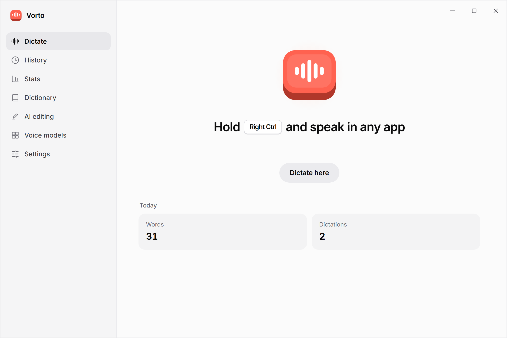
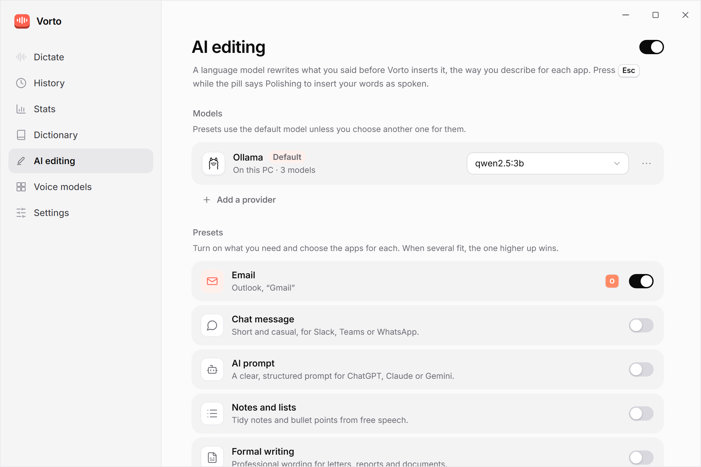
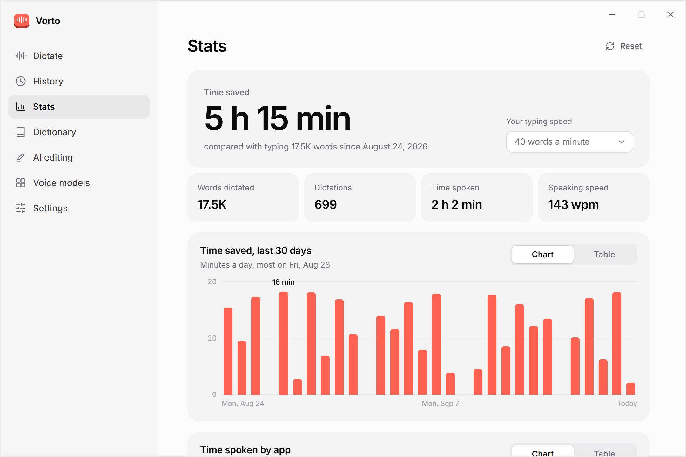
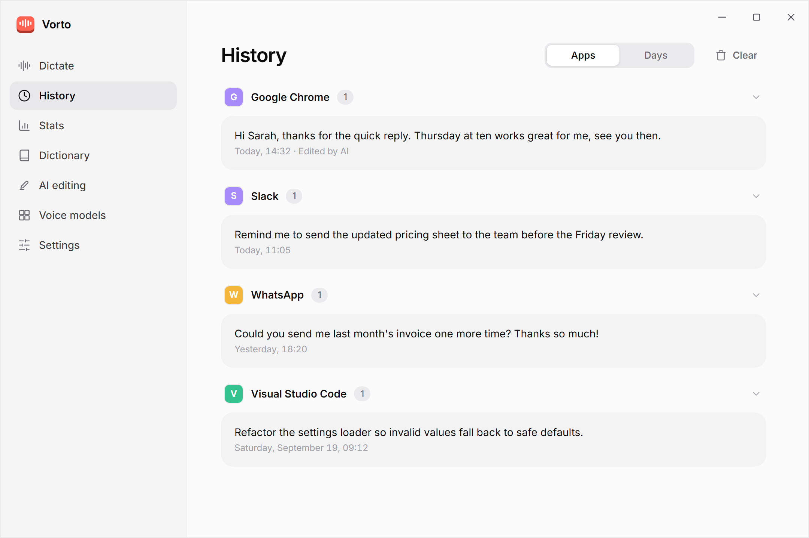
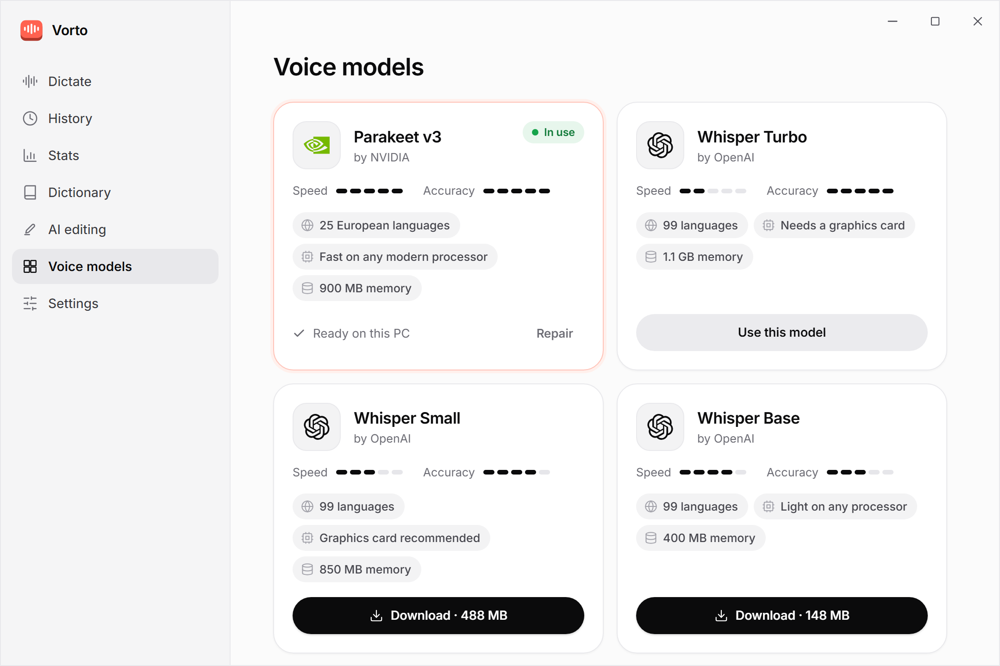
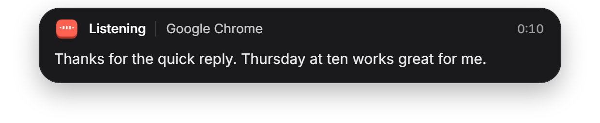

<div align="center">


# Vorto

**Talk into any app on your PC. Your voice never leaves it.**

Local, open-source dictation for Windows. Hold a shortcut, speak and let go:<br>
Vorto writes it down right where you were typing, and can polish it with AI on the way.

[](https://github.com/edgar-kessler/vorto/releases/latest)
[](https://github.com/edgar-kessler/vorto/releases)
[](LICENSE)
[](#requirements)

### [Download for Windows](https://github.com/edgar-kessler/vorto/releases/latest/download/Vorto-Setup.exe)

<sub>Vorto-Setup.exe · Windows 10 22H2 or Windows 11, 64-bit · No account · <a href="https://github.com/edgar-kessler/vorto/releases/latest">Release notes</a></sub>

<br>

<picture>
  <source media="(prefers-color-scheme: dark)" srcset="docs/images/dictate-dark.png">
  
</picture>

</div>

## Highlights

- **Works in any app.** Mail, chats, documents, the browser: wherever you can type, Vorto pastes or types your words. A small pill shows them while you speak.
- **Stays on your PC.** Recognition runs locally with Parakeet v3 or Whisper. No account, no uploads, no telemetry.
- **Quick, even for long dictations.** Finished sentences are recognized while you're still talking, so the text is in place a moment after you let go.
- **AI editing, if you want it.** Presets turn what you said into a polite email in Outlook, a clear prompt in Claude or tidy notes, with a model on your PC or a provider you choose.
- **Your words, your spelling.** A dictionary for names and terms, replacements, and layout by voice: "new line", "as bullet points".
- **See what it saves you.** Stats show the time saved compared with typing, and History keeps your last 100 dictations, grouped by app.

<table>
  <tr>
    <td width="50%" valign="top">
      <picture>
        <source media="(prefers-color-scheme: dark)" srcset="docs/images/ai-editing-dark.png">
        
      </picture>
      <p align="center"><sub><b>AI editing</b></sub></p>
    </td>
    <td width="50%" valign="top">
      <picture>
        <source media="(prefers-color-scheme: dark)" srcset="docs/images/stats-dark.png">
        
      </picture>
      <p align="center"><sub><b>Stats</b></sub></p>
    </td>
  </tr>
  <tr>
    <td width="50%" valign="top">
      <picture>
        <source media="(prefers-color-scheme: dark)" srcset="docs/images/history-dark.png">
        
      </picture>
      <p align="center"><sub><b>History</b></sub></p>
    </td>
    <td width="50%" valign="top">
      <picture>
        <source media="(prefers-color-scheme: dark)" srcset="docs/images/voice-models-dark.png">
        
      </picture>
      <p align="center"><sub><b>Voice models</b></sub></p>
    </td>
  </tr>
</table>

## Download & install

1. Download **[Vorto-Setup.exe](https://github.com/edgar-kessler/vorto/releases/latest/download/Vorto-Setup.exe)** from the [latest release](https://github.com/edgar-kessler/vorto/releases/latest).
2. Run it. Vorto installs for your account into `%LOCALAPPDATA%\Vorto` and doesn't need administrator rights. If Microsoft Edge WebView2 is missing, the installer adds it.
3. The short setup helps you download a voice model (once), test your microphone, pick your shortcut and, if you like, connect AI editing.
4. Click into any text field, hold <kbd>Right Ctrl</kbd>, speak and let go.

> [!NOTE]
> **"Windows protected your PC"?** Vorto isn't code-signed yet, so SmartScreen may warn you about the installer. Select **More info**, then **Run anyway**. Every release is built from its tagged source on GitHub Actions.

### Requirements

| | |
|---|---|
| **Windows** | Windows 11, or Windows 10 22H2, 64-bit |
| **Processor** | Intel or AMD with AVX2: Intel Core 4th generation or newer, AMD Ryzen, Intel N100 |
| **Memory** | 8 GB RAM recommended |
| **Storage** | About 1 GB, including a voice model |
| **Graphics card** | Not needed. Whisper runs faster with one. |

Processors without AVX2, such as the Celeron N4000, N4500 and N5100 or the Pentium Silver N5000 and N6000, aren't supported yet. Vorto explains this in the app. Windows 11 on Arm (24H2 or newer) runs Vorto through x64 emulation, but that isn't tested yet.

## Using Vorto

### Dictate

Hold your shortcut in any app, speak and let go. Your words go where the cursor was, and a short glow shows where they landed. <kbd>Esc</kbd> cancels, and nothing is kept. A dictation can be up to two minutes long.

Any key or combination works as the shortcut, including a single key like <kbd>Menu</kbd>. Hold it while you speak, or press once to start and again to finish (**Recording style**). Vorto pastes the text in one go and puts your clipboard back afterwards, or types it out if you prefer. Dictations stay out of Windows clipboard history.

<p align="center">
  
</p>

The pill at the top or bottom of the screen shows the app your words go into, a timer and the words as they come in, then a check once the text is in place.

### Voice models

Download one inside the app, once. After that, recognition runs on your PC.

| Model | Languages | Download | Hardware |
|---|---|---|---|
| **Parakeet v3** by NVIDIA · recommended | 25 European languages | 670 MB | Any modern processor |
| **Whisper Turbo** by OpenAI | 99 languages | 574 MB | Needs a graphics card |
| **Whisper Small** by OpenAI | 99 languages | 488 MB | Graphics card recommended |
| **Whisper Base** by OpenAI | 99 languages | 148 MB | Light on any processor |

Parakeet runs on the processor through ONNX Runtime. Whisper runs through whisper.cpp, on the graphics card via Vulkan (NVIDIA, AMD and Intel) when there is one.

### AI editing

Turn on **AI editing** and a language model rewrites each dictation before Vorto inserts it. The pill says **Polishing** meanwhile; <kbd>Esc</kbd> inserts your words as spoken instead, and so does a model that's slow or fails.

- **Presets:** Email, Chat message, AI prompt, Notes and lists, Formal writing and Clean up. Turn on the ones you want, pick their apps from the ones you've dictated into, or a website by a word from its tab title, such as Gmail. One preset can cover every other app, and you can add your own wishes to each. Email leaves the sign-off to your email signature.
- **Layout by voice:** say "new line", "three lines, the first says …" or "as bullet points", and the text is laid out that way.
- **Providers:** [Ollama](https://ollama.com) or LM Studio on your PC, found on their own, or OpenAI, Anthropic, Google Gemini, Groq, Mistral, OpenRouter, DeepSeek, xAI, Together AI and any OpenAI-compatible address. Paste a key, pick a model from the provider's list, or type any model ID. The default provider is marked, and presets use its model unless you choose another. API keys are kept in Windows Credential Manager.

Small local models are fast but make mistakes. Models from about 3 billion parameters, such as `qwen2.5:3b` or `gemma3:4b` in Ollama, follow the instructions much more reliably. Vorto loads a local model while you speak, so it's ready when you let go.

### Dictionary, Stats and History

- **Dictionary:** names and terms Vorto should spell your way (Whisper listens for them, AI editing keeps them), with suggestions from your dictations. **Replacements** swap words in every dictation, and `\n` stands for a line break.
- **Stats:** the time dictation saved you compared with typing at your speed, words, dictations, the last 30 days and speaking time by app. Only numbers, never text.
- **History:** your last 100 dictations, grouped by app or by day, ready to copy again. **Copy as spoken** gives you the original words when AI editing changed them. Turn off **Save history** to keep nothing.

### Tray, shortcuts and settings

The tray icon's menu pastes or copies your last dictation, pastes one of the last five again and turns AI editing on or off. **Settings → More shortcuts** sets key combinations for the same, plus undoing the last insertion.

**Settings** also covers appearance (light, dark or like Windows), the microphone, the language, sounds, starting with Windows, whether the model stays loaded, and updates. **Reset everything** deletes your settings, dictionary, AI editing setup, API keys, History and Stats and starts the setup again; downloaded voice models stay. Closing the window keeps Vorto in the tray; **Quit Vorto** is in the tray icon's menu.

## Privacy

Vorto listens, recognizes and inserts text on your PC. Your voice never leaves it, and neither does the text, unless you choose an online provider for AI editing.

- There's no account and no telemetry.
- The microphone is off unless you're dictating or testing it in Settings.
- Vorto uses the network for two things: downloading voice models from Hugging Face, and checking GitHub Releases for updates. Model files are pinned to a fixed commit and checked by size and SHA-256 before they're used.
- AI editing is off until you turn it on. With Ollama or LM Studio it stays on your PC. An online provider receives the text of your dictations, never the audio, and only after you allow it for that provider. Loading the model list of an online provider also reads OpenRouter's public model catalog, for names and prices; that sends no text and no key.
- Recordings reach the voice engine as temporary files that Windows deletes as soon as they're closed, even if Vorto is ended.
- Logs are for diagnostics only. They never contain what you said.

## Updates

Vorto checks for a new version when it starts and every 6 hours, downloads it in the background and then shows **Restart to update** in the sidebar and in **Settings → About**. Update files are signed, and Vorto refuses any without a valid signature.

Turn off **Update automatically** in Settings if you'd rather decide yourself. **Check for updates** in **Settings → About** works any time.

## Performance

<!-- performance:start -->
Measured with the installed Vorto 1.0.0 on Windows 11, a Ryzen 7 5700X3D (8 cores, 16 threads), 16 GB RAM and an RTX 4060, with Parakeet v3 loaded. CPU is the share of all 16 threads, memory is what Task Manager shows.

| While Vorto is | CPU | Memory | Graphics card |
|---|---|---|---|
| Idle, window open | 0.0 % | 816 MB | 0 % |
| Idle, in the tray | 0.0 % | 806 MB | 0 % |
| Recording, pill on screen | 0.1 % | 812 MB | 0 % |
| Recognizing while you speak (live preview) | about 13 % (2 of 16 threads) | up to about 1 GB | 0 % |

Nearly all of that memory is the voice model (about 690 MB for Parakeet v3). The app itself takes 6 MB and its window about 110 MB. **Keep model ready** in Settings frees the model's memory after a few idle minutes; on PCs with 8 GB of RAM or less, that's the default. Nothing animates or polls while Vorto waits, and a hidden window is put to sleep.
<!-- performance:end -->

The voice engine on its own, recognizing a 12-second English clip on a Ryzen 7 5700X3D with an RTX 4060:

| Model | Runs on | Time | Memory |
|---|---|---|---|
| Parakeet v3 | Processor | 0.49 s | 719 MB RAM loaded, ~890 MB peak |
| Whisper Turbo | Graphics card | 0.65 s | ~1.1 GB video memory, ~110 MB RAM loaded |
| Whisper Small | Graphics card | 0.30 s | ~870 MB video memory |
| Whisper Base | Graphics card | 0.15 s | ~420 MB video memory |

Long dictations don't wait for one big pass at the end: while you speak, finished sentences are recognized at pauses, so after you let go only the last few seconds are left. On the test PC, text appears about 0.2 to 0.7 seconds after release, even for long dictations. To measure your own PC, see [`scripts/benchmark.mjs`](scripts/benchmark.mjs).

## FAQ

<details>
<summary><b>Which voice model should I pick?</b></summary>
<br>

Start with **Parakeet v3**. It's fast and accurate on any modern processor. If your language isn't one of its 25 European languages, use Whisper: **Turbo** with a graphics card, **Base** on a PC without one.

</details>

<details>
<summary><b>Why didn't the text appear in an app?</b></summary>
<br>

Windows doesn't let normal apps type into apps running as administrator. In that case Vorto keeps the text on the clipboard and tells you, so you can paste it with <kbd>Ctrl</kbd>+<kbd>V</kbd>.

</details>

<details>
<summary><b>Does Vorto work without an internet connection?</b></summary>
<br>

Yes. You need a connection once to download a voice model. After that, dictation works offline.

</details>

<details>
<summary><b>Do I need a graphics card?</b></summary>
<br>

No. Parakeet v3 runs on the processor. A graphics card makes Whisper much faster, and Whisper Turbo needs one. Vorto uses NVIDIA, AMD and Intel graphics through Vulkan.

The first time a Whisper model starts on the graphics card after installing or updating Vorto, the graphics driver prepares it once, which can take 15 seconds or so. After that it starts in about a second and a half.

</details>

<details>
<summary><b>Vorto says my processor isn't supported.</b></summary>
<br>

Vorto needs a processor with AVX2, which most PCs made since 2015 have. Some low-power chips don't, such as the Celeron N4000, N4500 and N5100 or the Pentium Silver N5000 and N6000. They aren't supported yet.

</details>

<details>
<summary><b>Where does Vorto keep my data?</b></summary>
<br>

In `%LOCALAPPDATA%\app.vorto.desktop`. Open it from **Settings → About → Data folder**.

- `settings.json`: your settings
- `history.json`: your last 100 dictations
- `stats.json` and `apps.json`: numbers for Stats and the apps you dictated into, never text
- `models\`: downloaded voice models
- `vorto.log` and `engine.log`: diagnostics, never transcripts

**Start with Windows** adds a `Vorto` value under `HKCU\Software\Microsoft\Windows\CurrentVersion\Run`.

</details>

<details>
<summary><b>How do I uninstall Vorto?</b></summary>
<br>

Open Windows **Settings → Apps → Installed apps**, find Vorto and choose **Uninstall**. Select **Delete the application data** to also remove voice models, settings and history.

</details>

## Reporting bugs

Please [open an issue](https://github.com/edgar-kessler/vorto/issues/new/choose). These help a lot:

- Vorto version (**Settings → About**) and Windows version (run `winver`)
- Processor, graphics card and the voice model you use
- What happened, what you expected, and the steps to get there
- `vorto.log` and `engine.log` from the data folder (**Settings → About → Data folder → Open**). They don't contain transcripts, but please look through them before you attach them.

Found a security issue? Please report it privately, as described in [SECURITY.md](SECURITY.md).

## Building from source

You need Windows 10 or 11 (x64), Rust 1.98.1 or newer, Node.js 24, Visual Studio 2022 or newer with **Desktop development with C++**, CMake and LLVM. The graphics card build also needs the Vulkan SDK.

```bat
npm ci --prefix ui
npm --prefix ui run build
cargo test --workspace
scripts\build.cmd
```

The app embeds the built UI from `ui\dist`, so build it before `cargo test`. `scripts\build.cmd` makes a release build of the app and both voice engines in `C:\vt\release`. Add `--cpu` to leave out the graphics card engine (then the Vulkan SDK isn't needed), or `--installer` for the NSIS installer in `target\release\bundle\nsis\`.

[CONTRIBUTING.md](CONTRIBUTING.md) covers the details, UI development in the browser and the checks to run before a pull request.

## How it works

Vorto is two processes. **`vorto.exe`** is a Tauri 2 app with a Svelte interface: it listens for your shortcut, records the microphone, shows the pill and inserts the text. The voice engine runs the model: **`vorto-engine.exe`** runs Parakeet through ONNX Runtime and Whisper on the processor, **`vorto-engine-gpu.exe`** runs Whisper on the graphics card. App and engine talk in JSON lines over standard input and output.

Keeping recognition in its own process means a crashing model or graphics driver can't take the app down: Vorto restarts the engine and carries on. [docs/architecture.md](docs/architecture.md) explains the details.

## Contributing

Bug reports, testing on different hardware and pull requests are all welcome. Please read [CONTRIBUTING.md](CONTRIBUTING.md) and the [Code of Conduct](CODE_OF_CONDUCT.md). For changes to the interface, [docs/design.md](docs/design.md) describes how Vorto looks and speaks.

## License & credits

Vorto is released under the [MIT License](LICENSE). Copyright © 2026 Edgar Kessler.

Vorto stands on the work of others:

- [Parakeet TDT 0.6B v3](https://huggingface.co/nvidia/parakeet-tdt-0.6b-v3) by NVIDIA (CC-BY-4.0), through the [ONNX export](https://huggingface.co/istupakov/parakeet-tdt-0.6b-v3-onnx) by istupakov
- [Whisper](https://github.com/openai/whisper) by OpenAI (MIT), through [whisper.cpp](https://github.com/ggml-org/whisper.cpp) by ggml-org (MIT)
- [ONNX Runtime](https://github.com/microsoft/onnxruntime) (MIT), through the [`ort`](https://github.com/pykeio/ort) crate
- [Tauri](https://tauri.app), [Svelte](https://svelte.dev) and the [Inter](https://rsms.me/inter/) typeface (OFL)
- AI provider logos from [LobeHub Icons](https://github.com/lobehub/lobe-icons) (MIT)

The installer includes `THIRD-PARTY-NOTICES.txt` with the licenses of everything built into Vorto. NVIDIA, Parakeet, OpenAI, Whisper and the names and logos of the AI providers are trademarks of their respective owners. Vorto isn't affiliated with them.
