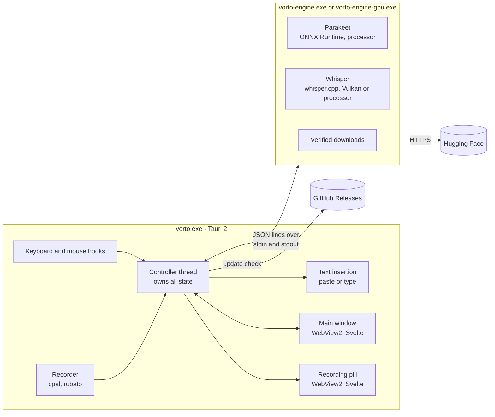

# Vorto architecture

How Vorto is put together, for people who want to read, change or review the code. For using Vorto, see the [README](../README.md). For building it, see [CONTRIBUTING.md](../CONTRIBUTING.md).

## At a glance

Vorto runs as two processes. The app records, decides and inserts; the engine only recognizes speech. The engine comes in two builds: `vorto-engine.exe` for Parakeet and Whisper on the processor, and `vorto-engine-gpu.exe` for Whisper on the graphics card.



Nothing else talks to the network. Audio and text stay on the PC.

## Repository layout

It's a Cargo workspace with three crates, plus the web UI and the landing page.

| Path | Crate or package | Role |
|---|---|---|
| `src/` | `vorto` (library) | Shared core: `audio`, `data`, `protocol`, `provider`, `supervisor` |
| `engine/` | `vorto-engine` (binary) | The recognition process, built twice: `vorto-engine.exe` and `vorto-engine-gpu.exe` |
| `app/` | `vorto-app` (binary `vorto.exe`) | The Tauri 2 desktop app |
| `ui/` | `vorto-ui` | Svelte 5 and Vite, rendered in WebView2 |
| `site/` | | The landing page, published with GitHub Pages |
| `scripts/` | | `build.cmd`, `benchmark.mjs`, `notices.mjs` |

### The `vorto` library

- **`audio`** captures the microphone with cpal and converts it to 16 kHz mono with rubato. It also finds pauses between words: the latest 360 ms stretch that is quiet compared with the background noise and the speech around it, or, when there is no clear pause, the quietest stretch, so a cut never lands inside a word.
- **`data`** holds the voice model catalog, settings and history. Every model is pinned to a full commit of its Hugging Face repository, with the size and SHA-256 of each file. Settings and history are written atomically: to a temporary file in the same folder, flushed, then renamed over the old one.
- **`protocol`** defines the messages between app and engine.
- **`provider`** is the `TranscriptionProvider` trait that both engines implement. A provider declares whether it runs on the device, and a remote one would have to reject audio without explicit consent. Vorto ships only on-device providers.
- **`supervisor`** starts and watches the engine process (see [The supervisor](#the-supervisor)).

## A dictation, step by step

1. **Shortcut.** Low-level keyboard and mouse hooks (`app/src/hotkey.rs`) run on their own high-priority thread. The callbacks only update atomics and send a message, because Windows removes hooks that respond slowly. For the same reason the hooks are renewed every few seconds. Input that Vorto injects itself is tagged and ignored.
2. **Start.** The controller notes the window that has focus and looks up its program name and icon, then opens the microphone and shows the pill with that app.
3. **While speaking.** At most every 400 ms, and never while a request is in flight, the controller prepares audio on a worker thread so level meters and hooks never stall:
   - Once more than about 9 seconds are waiting, it looks for a pause and **commits** everything before it: that part is recognized for good.
   - If there's no pause for about 20 seconds, it cuts at the quietest point instead.
   - Otherwise, with **Live preview** on, it sends a **preview** of the words since the last commit, which the pill shows.

   Previews run for Parakeet, and for Whisper on the graphics card. Stretches without speech are skipped, because Whisper tends to invent words for silence.
4. **Release.** Only the audio after the last commit still needs recognition, usually a few seconds. That's why insertion takes about 0.2 to 0.7 seconds after release on the test PC, even for long dictations.
5. **Insertion** (`app/src/native.rs`), off the controller thread and one at a time:
   - **Paste:** Vorto waits until modifier keys are released, puts the text on the clipboard with the formats that keep it out of Windows clipboard history and cloud sync, and sends <kbd>Ctrl</kbd>+<kbd>V</kbd>. About 1.2 seconds later it restores the previous plain-text clipboard, unless something else was copied in the meantime.
   - **Type:** Vorto sends the text as Unicode key input and leaves the clipboard alone.
   - Windows silently drops input sent from a normal app to one running as administrator. Vorto detects that case, keeps the text on the clipboard and says so.
6. **After.** The text goes into history (unless it's turned off), and the pill shows the outcome: a green check, a red cross or a grey notice.

<kbd>Esc</kbd> cancels at any point while a dictation runs. A dictation stops on its own after two minutes.

Audio reaches the engine as temporary WAV files opened with `FILE_FLAG_DELETE_ON_CLOSE`, so Windows deletes them when the last handle closes, even if Vorto is killed.

## The engine

The engine is a small process without a window. It reads one JSON command per line on standard input, writes one JSON event per line on standard output, and writes diagnostics to standard error, which the supervisor sends to `engine.log`. It exits when its input closes.

Keeping recognition in its own process has two benefits:

- A model, driver or out-of-memory crash ends the engine, not the app. The app shows what happened and starts a new engine.
- The app process stays small. Model memory belongs to a process that can be ended to free it.

### Protocol

Commands (`op`) and events (`event`) from `src/protocol.rs`:

| Command | Fields | Replies |
|---|---|---|
| `load` | `root`, `model`, `gpu` | `ready` or `error` |
| `transcribe` | `audio` (WAV path), `language` | `result` with `text`, or `error` |
| `preview` | `audio`, `language` | `preview` with `text`, `ok` and an optional detected `language`. A failed preview is reported with `ok: false`, never as an error, so it can't end a dictation. |
| `download` | `root`, `model` | `progress` with `detail` and `fraction`, then `downloaded` or `error` |

```json
{"op":"transcribe","audio":"C:\\Users\\you\\AppData\\Local\\Temp\\vorto-A1b2C3.wav","language":"auto"}
{"event":"result","text":"Thursday at ten works great for me."}
```

Audio must be 16 kHz mono and at most two minutes long.

### Recognition

- **Parakeet TDT 0.6B v3** (`engine/src/parakeet.rs`) runs through ONNX Runtime on the processor, using the int8 ONNX export: a mel preprocessor (`nemo128.onnx`), the Conformer encoder, and a greedy TDT decoder. Parakeet detects the language itself. ONNX Runtime is linked statically through the `ort` crate.
- **Whisper** (`engine/src/whisper.rs`) runs through whisper-rs and whisper.cpp. With the `vulkan` feature, and when the PC has a Vulkan loader, it runs on the graphics card (NVIDIA, AMD or Intel). If loading or the warm-up pass fails on the graphics card, the engine falls back to the processor.
- Every load ends with a short warm-up pass on silence, so the first dictation doesn't pay for kernel compilation and allocations.
- Inference uses one thread per performance core, at most 8. PCs with four cores or fewer keep one core free for recording and the desktop. The engine also opts out of Windows 11's power throttling for background processes, since the user is waiting for the result.

### Starting on every PC

The prebuilt ONNX Runtime imports DirectML, Direct3D 12 and DXGI even though Vorto only uses it on the processor, and whisper.cpp's Vulkan backend imports the Vulkan loader, which only graphics drivers install. `engine/build.rs` delay-loads all of them, so the engine starts on every Windows 10 and 11 PC and only touches them when they're used.

The engine turns off Windows error dialogs and writes a line to `engine.log` when it crashes.

### Downloads

`engine/src/download.rs` fetches every file from `https://huggingface.co/<repo>/resolve/<revision>/<file>`, using the revision built into the app. Nothing the server says about the files is trusted:

- Each file must match the size and SHA-256 from the catalog. A mismatch deletes the file and fails the download.
- Files collect in a hidden `.partial` folder. Interrupted downloads continue where they stopped, as long as the revision is the same, and dropped connections are retried a few times.
- The engine checks for free disk space first.
- Only when every file has passed does the folder get a `verified` marker and move into place. A model without the marker counts as not installed.
- TLS goes through Windows (native-tls), so it trusts the certificates Windows trusts, including a company's own. Proxies come from Windows' settings through WinHTTP, including proxy scripts (PAC) and automatic detection.

## The supervisor

`src/supervisor.rs` owns the engine process on the app side.

- **Before starting**, it checks the processor for AVX2 and the related instruction sets (AVX, FMA, F16C, BMI1, BMI2, LZCNT) that ONNX Runtime and whisper.cpp are built for. Without them the engine would crash on its first instruction, so Vorto explains the problem in the app instead.
- **Phases** are `setup`, `starting`, `ready`, `sleeping`, `downloading`, `transcribing` and `error`. Every busy phase has a deadline, measured from the last sign of progress: **90 s** to start, **180 s** to transcribe and **60 s** for a stalled download.
- **Hangs and crashes:** when a deadline passes or the process exits, the supervisor kills it and reports an error. The controller starts a new engine, and a dictation that was waiting keeps its audio. If a graphics driver took the engine down, Whisper stays on the processor for the rest of the session.
- **Idle:** when **Keep model ready** has a timer, the engine is stopped after that time to free memory, and started again for the next dictation.
- `engine.log` starts fresh when it grows past 1 MB. Implicit Vulkan layers, often added by recording and overlay tools, are turned off for the engine, because they're a common cause of crashes.

## The app

`vorto-app` is a Tauri 2 app (`app/src/`).

- **`controller.rs`** is the single owner of app state. It runs on its own thread and receives messages from the hooks, the recorder, the engine, the updater and the UI. It publishes two snapshots: the full state for the main window, only while that window is on screen, and a small one for the recording pill.
- **`hotkey.rs`** handles shortcuts of up to four keys or mouse buttons, hold and toggle modes, and <kbd>Esc</kbd>. A modifier-only shortcut such as Right Ctrl doesn't get in the way of combinations like Ctrl+C, and a held Alt or Win doesn't open menus.
- **`native.rs`** covers Windows integration: the target app's name and icon, text insertion, the clipboard, the check for apps running as administrator, and **Start with Windows**, a `Vorto` value under `HKCU\Software\Microsoft\Windows\CurrentVersion\Run`.
- **`update.rs`** wraps Tauri's updater (see [Updates](#updates)).
- **`main.rs`** sets up the windows, the tray icon and single-instance handling. The main window hides instead of closing. While it's hidden, its WebView2 is suspended, so it stops rendering and frees memory while Vorto sits in the tray.
- **`log.rs`** writes `vorto.log`, which never contains transcript text.

### Windows

| Window | Content | Notes |
|---|---|---|
| `main` | `index.html` | Dictate, History, Voice models, Settings, and onboarding. No system title bar. |
| `hud` | `index.html#hud` | The recording pill: 620 × 220, transparent, always on top, never takes focus, not in the taskbar |

## The interface

`ui/` is a Svelte 5 app built with Vite. `ui/src/lib/api.js` connects it to the controller through Tauri commands and events. Outside Tauri it loads `ui/src/lib/mock.js` instead, a stand-in for the Rust side, so the whole interface can be designed in a normal browser. The URL parameters at the top of `mock.js` show specific states.

The look, motion and wording follow [design.md](design.md).

### Security boundaries

- A Content Security Policy in `app/tauri.conf.json` allows only the app's own scripts, its own and inline styles, images from the app or data URLs, and IPC connections.
- `app/capabilities/default.json` grants the windows the core defaults plus minimizing, maximizing, closing and dragging. Everything else goes through Vorto's own commands to the controller.
- The UI never gets file system, shell or network permissions.

## Data on disk

Everything lives in `%LOCALAPPDATA%\app.vorto.desktop`, named after the app identifier:

| Path | Content |
|---|---|
| `settings.json` | Settings |
| `history.json` | The last 100 dictations, if history is on |
| `models\<id>\` | Verified voice models |
| `models\.<id>.partial\` | A download in progress |
| `vorto.log`, `engine.log` | Diagnostics only, never transcripts |

WebView2 keeps its browser profile in the same folder. The installer puts the program into `%LOCALAPPDATA%\Vorto`. Its uninstaller removes the autostart value, and its **Delete the application data** option removes the data folder.

## Updates

Vorto checks `https://github.com/edgar-kessler/vorto/releases/latest/download/latest.json` at start and every 6 hours. A new version downloads in the background, and the app offers **Restart to update**. It never installs in the middle of a dictation or a model download.

Update files are signed with minisign. The public key is in `app/tauri.conf.json`, and the updater refuses files that don't match it. The app stops its engine before it starts the installer, and the installer's hooks end any Vorto process still running, because Windows won't replace a running executable. Engines belong to a Windows job object that ends them together with the app, however the app ends.

## Builds and releases

- **Two engines.** `vorto-engine.exe` is built with the default `parakeet` feature. `vorto-engine-gpu.exe` is the same crate built with `--no-default-features --features vulkan`: Whisper on the graphics card, without ONNX Runtime. It's a separate executable because whisper.cpp's Vulkan backend loads the Vulkan loader (`vulkan-1.dll`, installed by graphics drivers) even to run on the processor. The app starts it only for Whisper with the graphics card on, when `vulkan-1.dll` is in System32; if it crashes, the app switches to the processor engine for the rest of the session. `scripts\build.cmd --cpu` leaves it out.
- **Delay-loaded libraries.** The prebuilt ONNX Runtime imports DirectML, Direct3D 12 and DXGI, and the Vulkan backend imports `vulkan-1.dll`. `engine/build.rs` delay-loads them, so the engine starts on PCs without them, and `scripts/stage.mjs` checks every executable's imports before an installer is built.
- **Instruction set baseline.** whisper.cpp is compiled for AVX2 (`.cargo/config.toml`), not for the build machine's processor, so a build runs on every supported PC.
- **Installer.** Tauri's NSIS bundler creates a per-user installer that embeds the WebView2 bootstrapper. `app/tauri.release.conf.json` adds both engines, the Visual C++ runtime DLLs and `THIRD-PARTY-NOTICES.txt`, which `scripts/notices.mjs` generates.
- **Releases.** Pushing a tag `vX.Y.Z` runs `.github/workflows/release.yml`, which builds on GitHub Actions, signs the installer for the updater in a separate step (the only one that sees the key), checks the signature against the public key and publishes the installer, `Vorto-Setup.exe`, the signature and `latest.json`.

## Tests

`cargo test --workspace` runs the unit tests in the library, the engine and the app, and `engine/tests/protocol.rs`, which starts the real engine, sends it malformed and impossible commands, and checks that each one gets an error and the engine still exits cleanly when its input closes. `node scripts/benchmark.mjs` measures loading, recognition speed and memory for each voice model with your own recordings.
